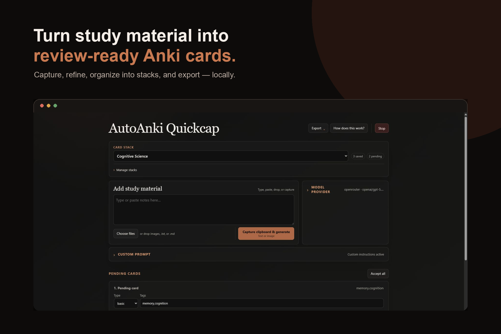
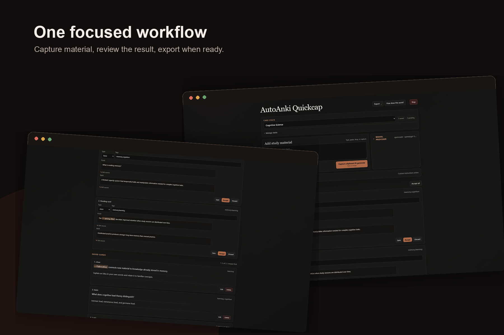

# AutoAnki

Turn notes, screenshots, and study material into reviewed Anki cards.



AutoAnki runs locally in its own desktop window. Type or paste notes, drop in
supported files, or capture text and images from your clipboard. An LLM drafts
the cards; you edit, discard, or accept each one before anything is saved.

## Download

- **Windows:** [portable x64 app](https://github.com/markschroedr/autoanki/releases/latest/download/AutoAnki-Portable-Windows-x64.zip)
- **macOS:** [portable Apple Silicon app](https://github.com/markschroedr/autoanki/releases/latest/download/AutoAnki-Portable-macOS-arm64.zip)

Unzip the download and open `AutoAnki.exe` or `AutoAnki.app`. No Python or
installer is required. The macOS build is unsigned, so first launch it with
Control-click → **Open**.

## How it works

1. Type or paste text, choose a supported image, `.txt`, or `.md` file, or
   capture text or an image from your clipboard.
2. Generate cards into the currently selected stack.
3. Review and edit the drafts, then accept or discard them.
4. Export the current stack or all stacks as an Anki `.apkg` package.



Pending drafts survive restarts. Each stack keeps its own drafts, saved cards,
export state, and stable Anki deck identity. Renaming a stack changes its deck
name without creating a different deck.

## Models and privacy

OpenRouter, OpenAI, Anthropic, and Gemini are supported. Choose a provider and
model in Settings, then enter your own API key. Keys, cards, prompts, and
exports stay in the portable folder; only material you submit for generation is
sent to the selected provider.

Back up `data/` to preserve your stacks. Generated Anki packages are written to
`exports/` in portable builds.

## Run from source

Requires Python 3.12+ and [uv](https://docs.astral.sh/uv/).

```bash
uv sync
cp .env.example .env
uv run autoanki-web
```

The source version uses `data/` for cards and `output/` for exports. There is
also a CLI available through `uv run autoanki`; use `--help` for its stack and
export options. Provider details live in [docs/providers.md](docs/providers.md).

## Development

```bash
uv run python -m unittest discover -s tests
uv run python -m scripts.real_webui_e2e
```

Portable release instructions are in [docs/release.md](docs/release.md).

Licensed under the [MIT License](LICENSE).
